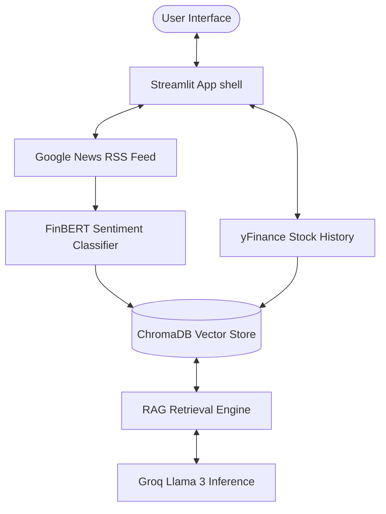

# FinSight AI — Stock Sentiment Analyzer & RAG-Powered Financial Assistant

[](https://www.python.org/downloads/)
[](https://streamlit.io/)
[](https://huggingface.co/)
[](https://pytorch.org/)
[](https://www.trychroma.com/)
[](https://groq.com/)

FinSight AI is a premium financial intelligence dashboard designed to convert raw stock market indicators and news items into clean, actionable analyst insights. It combines real-time data ingestion, local machine learning models (FinBERT), persistent vector search (ChromaDB), and high-speed LLM inference (Groq) in a Retrieval-Augmented Generation (RAG) architecture.

---

## 🏗️ System Architecture

The dashboard implements a modular processing pipeline to query, analyze, index, and chat with market data:



---

## 📂 Recruiter Guide: Codebase Deep Dive

If you are a recruiter or technical interviewer checking out this project, here is where the core engineering patterns live:

| Engineering Concept | Core File Path | Implementation Details |
| :--- | :--- | :--- |
| **NLP Sentiment Analysis** | [`sentiment.py`](file:///d:/nirbhay/Stock%20analyzer/stock_analyzer/sentiment.py) | Loads `ProsusAI/finbert` via Hugging Face pipeline to perform local, batched financial sentiment classification. |
| **Vector DB Indexing & RAG** | [`rag.py`](file:///d:/nirbhay/Stock%20analyzer/stock_analyzer/rag.py) | Connects to **ChromaDB** using `PersistentClient` to create embeddings, index articles, execute queries, and clear stale ticker states. |
| **LLM Orchestration & Prompting** | [`llm_agent.py`](file:///d:/nirbhay/Stock%20analyzer/stock_analyzer/llm_agent.py) | Orchestrates the `llama-3.3-70b-versatile` model over Groq API, enforcing strict boundaries, structured markdown verdicts, and conversational RAG chat. |
| **Market Data Acquisition** | [`data.py`](file:///d:/nirbhay/Stock%20analyzer/stock_analyzer/data.py) | Downloads price history and cleans multi-index OHLCV structures from `yfinance` with Streamlit caching. |
| **Interactive Charting** | [`charts.py`](file:///d:/nirbhay/Stock%20analyzer/stock_analyzer/charts.py) | Implements detailed Plotly charts for Candlestick patterns, Volume bars, and Moving Averages (`MA20`, `MA50`). |
| **UI Structure & State** | [`main.py`](file:///d:/nirbhay/Stock%20analyzer/stock_analyzer/main.py) | Handles session states, UI sections, sidebar logic, and coordinates data pipeline interactions. |

---

## ⚡ Technical Highlights

* **Caching & Performance Optimization:** Uses Streamlit's `@st.cache_data` and Python's `lru_cache` decorators to cache dataset calculations and avoid reloading heavy ML models (`FinBERT`) on every UI re-render.
* **Lazy Module Importing:** Delays importing heavy frameworks like `torch` and `transformers` until runtime functions are explicitly invoked. This ensures the app boots up and presents visual elements immediately.
* **Deterministic RAG Boundaries:** Employs defensive prompting instructions inside the LLM orchestrator to prevent hallucination, forcing the agent to rely strictly on context fetched from ChromaDB.

---

## 🚀 Getting Started

### Prerequisites
* **Python 3.11.9** (Recommended)
* **Groq API Key** (Free tier available on [console.groq.com](https://console.groq.com/))

### 1. Installation

Clone the project to your local directory:
```bash
git clone <your-repo-link>
cd "Stock analyzer"
```

Create and activate a virtual environment:
```bash
# On Windows
python -m venv .venv
.venv\Scripts\activate

# On macOS/Linux
python3 -m venv .venv
source .venv/bin/activate
```

Install dependencies:
```bash
pip install -r requirements.txt
```

### 2. Configuration (`.env`)

Create a file named `.env` in the project root directory and add your credentials:
```env
GROQ_API_KEY=your_groq_api_key_here
HF_TOKEN=your_huggingface_write_token_here (optional)
```

### 3. Launching the App

Start the Streamlit server:
```bash
streamlit run app.py
```
The application will open automatically in your browser at `http://localhost:8501`.

---

## 💡 How to Use the App

1. **Build a Portfolio:** Use the **Portfolio multiselect** in the sidebar to add or remove ticker symbols (e.g., `AAPL`, `NVDA`, `TSLA`).
2. **Select Date Ranges:** Select the date boundaries for historical performance.
3. **Analyze Sentiment:** The application crawls news headlines automatically, runs them through the FinBERT classifier, and shows sentiment trend distribution (Positive, Neutral, Negative).
4. **Generate AI Analyst Reports:** Toggle **AI analyst** on to get automatic Bull Case, Bear Case, Risks, and Verdict cards generated by Groq.
5. **Chat with Data (RAG Chat):** Ask the chatbot questions in the chat feed (e.g., *"What is the main concern regarding NVDA according to the latest articles?"*). The assistant will query ChromaDB for news headlines and give you context-grounded answers.

---

## 👤 Author

**Nirbhay Singh**  
*Artificial Intelligence & Machine Learning Engineer*

Focused on building production-ready AI systems, RAG applications, NLP solutions, and intelligent data-driven products. Feel free to connect or ask questions!
