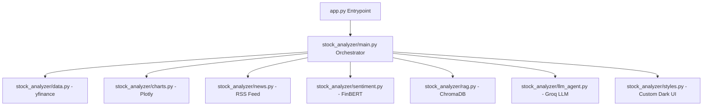

# FinSight AI - Stock Sentiment Analyzer & RAG Assistant

FinSight AI is a premium, real-time stock market analysis dashboard built with Streamlit. It leverages financial API integrations, deep NLP sentiment analysis, vector search, and Large Language Models (LLMs) to provide users with actionable stock insights.

---

## 🏗️ Architecture & Component Overview

The application is structured as a modular Python package inside the [stock_analyzer](file:///d:/nirbhay/Stock%20analyzer/stock_analyzer) directory, coordinated by a central Streamlit entrypoint:

---

## 🛠️ Technology Stack & Dependencies

Below is a detailed list of the core technologies, libraries, and APIs used in this project, explaining **what they are** and **for what purpose** they are implemented.

### 1. User Interface & Presentation
* **Streamlit (`streamlit`)**
  * *Purpose:* Serves as the web framework to run the dashboard. It builds the interactive sidebars, panels, buttons, and manages the reactivity loop.
* **Plotly (`plotly`)**
  * *Purpose:* Renders high-performance interactive charts. It generates the custom candlestick charts, moving average indicators (`MA20` & `MA50`), and trading volume subplots under a tailored dark theme.
* **Streamlit Autorefresh (`streamlit-autorefresh`)**
  * *Purpose:* Enables live-updating capabilities, allowing users to toggle auto-refresh intervals (e.g., every 30 seconds) to simulate real-time tracking.
* **Custom CSS (`styles.py`)**
  * *Purpose:* Customizes Streamlit's look-and-feel. It overrides the default theme to build a premium, glassmorphic dark-mode shell, clean action chips, and a chat interface.

### 2. Market & News Data Gathering
* **yFinance (`yfinance`)**
  * *Purpose:* Fetches historical market data (Open, High, Low, Close, Volume) for selected stock tickers within specified date ranges.
* **Google News RSS Parser (`urllib` & `xml.etree.ElementTree`)**
  * *Purpose:* Scrapes the Google News RSS search feed dynamically for the selected ticker. It avoids rate limits and allows fetching recent headlines without requiring private developer API keys.

### 3. Natural Language Processing & Sentiment Scoring
* **FinBERT (`transformers` & `torch`)**
  * *Purpose:* Sentiment analysis on news headlines. The application loads `ProsusAI/finbert` (a BERT model specifically pre-trained on financial text) to label headlines as `positive`, `negative`, or `neutral` and output sentiment probability percentages.

### 4. Vector Database & RAG (Retrieval-Augmented Generation)
* **ChromaDB (`chromadb`)**
  * *Purpose:* Acts as the local vector database. It embeds, indexes, and stores fetched news headlines, market metrics, and summaries into a persistent local folder (`.chroma_stock_analyzer`).
* **Embeddings (`sentence-transformers`)**
  * *Purpose:* ChromaDB's default embedding model (`all-MiniLM-L6-v2`) is downloaded to convert news text into high-dimensional vector embeddings, enabling semantic search and retrieval during the AI chat.

### 5. Large Language Model Integration
* **Groq API Client (`groq` & `python-dotenv`)**
  * *Purpose:* Orchestrates the AI analysis. The application routes user prompts and vector-retrieved context to Groq's high-speed inference engine using the `llama-3.3-70b-versatile` model.
  * *Role:* It generates structured markdown reports consisting of a Bull Case, Bear Case, Risk Summary, and a final investment verdict, and powers the QA chat agent.

---

## 📂 Codebase Directory Guide

* **[app.py](file:///d:/nirbhay/Stock%20analyzer/app.py)**: The Streamlit app launcher (`streamlit run app.py`).
* **[requirements.txt](file:///d:/nirbhay/Stock%20analyzer/requirements.txt)**: Python package manifest specifying necessary library dependencies.
* **[stock_analyzer/main.py](file:///d:/nirbhay/Stock%20analyzer/stock_analyzer/main.py)**: The main orchestrator. It manages the sidebar inputs, handles layout logic, runs data queries, updates databases, and updates the chat history.
* **[stock_analyzer/data.py](file:///d:/nirbhay/Stock%20analyzer/stock_analyzer/data.py)**: Logic for fetching and cleaning stock ticker OHLC history via yFinance.
* **[stock_analyzer/charts.py](file:///d:/nirbhay/Stock%20analyzer/stock_analyzer/charts.py)**: Technical charting functions (Candlestick + Volume + Moving Averages).
* **[stock_analyzer/news.py](file:///d:/nirbhay/Stock%20analyzer/stock_analyzer/news.py)**: Google News feed scraper.
* **[stock_analyzer/sentiment.py](file:///d:/nirbhay/Stock%20analyzer/stock_analyzer/sentiment.py)**: Loads FinBERT via Hugging Face Pipeline to execute batch-sentiment analysis on scraped headlines.
* **[stock_analyzer/rag.py](file:///d:/nirbhay/Stock%20analyzer/stock_analyzer/rag.py)**: Connects to ChromaDB, manages vector stores, processes documents upserts, and performs semantic query matching.
* **[stock_analyzer/llm_agent.py](file:///d:/nirbhay/Stock%20analyzer/stock_analyzer/llm_agent.py)**: Manages Groq API calls, parses model instructions, formats contexts, and returns structured AI answers.
* **[stock_analyzer/styles.py](file:///d:/nirbhay/Stock%20analyzer/stock_analyzer/styles.py)**: Contains CSS injects, header HTML, and UI shell parameters.
* **[stock_analyzer/constants.py](file:///d:/nirbhay/Stock%20analyzer/stock_analyzer/constants.py)**: Holds configuration values such as stock ticker presets, chart dimensions, and the default Groq model ID.
